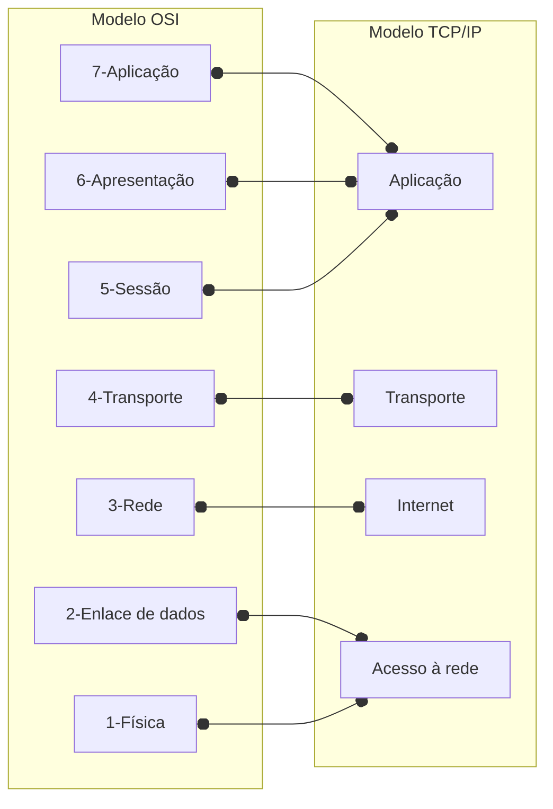

# Anotaçãoes sobre comunicação

 

## Termos comuns

### Largura de banda

É a  quantidade de dados que podem ser transmitidos de um ponto a outro em um determinado período de tempo. A largura de banda é medida em bits por segundo (bps).

 

### Taxa de transferência

É a quantidade de dados que podem ser transmitidos de um ponto a outro em um determinado período de tempo. A taxa de transferência é medida em bytes por segundo (Bps). Entretanto, devido a vários fatores, a taxa de trafêrencia não corresponde a largura de banda.

Fatores que podem influenciar a taxa de transferência:

- A quantidade de dados enviados e recebidos pela conexão
- Os tipos de dados transmitidos
- A latência criada pelo número de dispositivos de rede encontrados entre a origem e o destino

 

### Latência

É o tempo que um pacote de dados leva para ir de um ponto a outro. A latência é medida em milissegundos (ms).

 

### Jitter

É a variação na latência de um pacote de dados. O jitter é medido em milissegundos (ms).

 

### Dispositivos finais

Um dispositivo final (host) é a origem ou destino de uma mensagem transmitida pela rede. Exemplos de dispositivos finais são computadores, smartphones, tablets, etc.

 

### Dispositivos intermediários

Um dispositivo intermediário é um dispositivo que encaminha mensagens entre dispositivos finais. Exemplos de dispositivos intermediários são roteadores, switches, hubs, etc.

   

### Meios de rede

Os meios de rede são os métodos físicos ou sem fio usados para conectar dispositivos de rede. Exemplos de meios de rede são cabos de cobre, fibra óptica, ondas de rádio, etc.

 

## Clientes e servidores

### Cliente

São dispositivos que solicitam informações de um servidor. Os clientes podem ser computadores, smartphones, tablets, etc.

 

### Servidor

São dispositivos que fornecem informações a um cliente. Os servidores podem ser computadores, impressoras, etc.

 

### Redes ponto a ponto

São redes que conectam dois dispositivos diretamente. Nesse tipo de rede, um dispositivo atua como cliente e o outro como servidor.

 

## ISP (Internet Service Provider)

É uma empresa que fornece acesso à Internet para clientes. Os ISPs podem fornecer acesso à Internet por meio de conexões de banda larga, como DSL, cabo, fibra óptica, etc.

 

### Backbone da Internet

É uma rede de alta velocidade que conecta ISPs entre si. O backbone da Internet é composto por cabos de fibra óptica e outros meios de rede.

 

## Redes wireless

Tipos de redes wireless

- GPS (Global Positioning System)
- Wi-Fi
- Bluetooth
- NFC (Near Field Communication)
- RFID (Radio Frequency Identification)
- Celular
- Satélite

 

### Protocolos de comunicação

### Características dos protocolos de comunicação

- **Formato da mensagem**: O formato da mensagem é a estrutura dos dados transmitidos pela rede.
- **Tamanho da mensagem**: 5e o tamanho da mensagem for muito longa, pode  se**r necessário dividir uma mensagem grande em várias mensagens menores para transmiti-la pela rede.
- **Tempporização**: A temporização determina a velociadade com que os bits são transmitidos pela rede.
- **Codificação**: A codificação é o método usado para converter os dados em sinais elétricos ou ópticos para transmissão pela rede.
- **Encapsulamento**: O encapsulamento é o processo de adicionar informações de controle aos dados transmitidos pela rede.
- **Padrão de mensagens**: O padrão de mensagens é o formato dos dados transmitidos pela rede.

     

## Organizações de padronização

### IEEE

O IEEE (Institute of Electrical and Electronics Engineers) é uma organização que desenvolve padrões para tecnologias de rede. Alguns dos padrões de rede mais conhecidos desenvolvidos pelo IEEE são:

- 802.3 (Ethernet)
- 802.11 (Wi-Fi)
- 802.15 (Bluetooth)
- 802.16 (WiMAX) 

 

### IETF (Internet Engineering Task Force)

O IETF (Internet Engineering Task Force) é uma organização que cria padrões voluntários que são frequentemente adotados por usuários da Internet, operadores de rede e fornecedores de equipamentos.

 

### IANA (Internet Assigned Numbers Authority)

São responsáveis pela coordenação global da raiz do DNS (DNS root), o endereçamento IP e outros recursos do protocolo da Internet.

 

### ICANN (Internet Corporation for Assigned Names and Numbers)

A ICANN é uma corporação responsável pela alocação do espaço de endereços de Protocolos da Internet (IP), pela atribuição de identificadores de protocolos, pela administração do sistema de domínios de primeiro nível, tanto genéricos (gTLDs) quanto com códigos de países (ccTLDs), e também pelas funções de gerenciamento do sistema de servidores-raiz. Originalmente, esses serviços foram desempenhados segundo um contrato do governo dos EUA com a Internet Assigned Numbers Authority (IANA - Autoridade para Atribuição de Números na Internet) e outras entidades. Agora a ICANN desempenha a função da IANA.

 

## Modelos de comunicação de rede

### Modelo TCP/IP

O modelo TCP/IP é um modelo de comunicação de rede que divide as funções de rede em camadas.  
O modelo TCP/IP é composto por quatro camadas:

| Camada | Descrição |
| --- | --- |
|Camada de aplicação (Application)| Representa dados para o usuário, como páginas da web, e-mail, etc.|
|Camada de transporte (Transport)| Permite a comunicação entre vários dispositivos diferentes em redes distintas.|
|Camada de Internet (Internet)| Determina a melhor rota para os dados viajarem pela rede.|
|Camada de acesso à rede (Network Access)| Controla os dispositivos de hardware e o meio físico que formam a rede.|

 

### Modelo OSI (Open Systems Interconnection)

O modelo OSI é usado para projeto de redes de dados, especificações de operações e solução de problemas.  
O modelo OSI é composto por sete camadas:

|| Camada | Descrição |
| --- | --- | --- |
| 7 | Aplicação | Contém protocolos usados para comunicações processo a processo. |
| 6 | Apresentação | Fornece a representação comum de dados transferidos entre serviços da camada de aplicação. |
| 5 | Sessão | Fornece serviços à camada de apresentação para organizar o diálogo e gerenciar a troca de dados. |
| 4 | Transporte | Define serviços para segmentar, transferir e reagrupar os dados para comunicações individuais entre os dispositivos finais. |
| 3 | Rede | Fornece serviços para trocar dados individuais pela rede entre dispositivos finais identificados. |
| 2 | Enlace de dados | Descreve métodos para a troca de quadros de dados entre os dispositivos em um meio físico comum. |
| 1 | Física | Descreve os meios mecânicos, elétricos, funcionais e procedimentais para ativar, manter e desativar conexões físicas para uma transmissão de bits de e para um dispositivo de rede. |

 
 
### Comparação entre os modelos TCP/IP e OSI

 

## Camada de acesso

### Ethernet Frame (Quadro Ethernet)

| Preamble | Start Frame Delimiter | Destination MAC Address | Source MAC Address | Length or Type | Data | FCS |
| --- | --- | --- | --- | --- | --- | --- |
| 7 bytes | 1 byte | 6 bytes | 6 bytes | 2 bytes | 46-1500 bytes | 4 bytes |

 

O quadro Ethernet é a unidade de dados transmitida pela rede Ethernet. O quadro Ethernet é composto por:

- **Preamble**: Sincroniza os bits entre as placas NIC de origem e de destino.
- **Start Frame Delimiter (SFD)**: O SFD é um padrão de bits que indica o início do quadro Ethernet.
- **Destination MAC Address**: Endereço MAC do dispositivo que deve receber o quadro Ethernet.
- **Source MAC Address**: Endereço MAC do dispositivo que enviou o quadro Ethernet.
- **Length or Type**: Indica o tamanho do quadro Ethernet ou o tipo de dados transmitidos.
- **Data**: Os dados são os dados transmitidos pela rede.
- **FCS (Frame Check Sequence)**: O FCS é um valor de verificação de erros usado para verificar a integridade do quadro Ethernet.

  

## Switches

Os switches são dispositivos que encaminham quadros Ethernet entre dispositivos finais em uma rede. Os switches usam a tabela de endereços MAC para encaminhar quadros Ethernet.
Os switches tomam a decisão de encaminhamento com base no endereço MAC de destino do quadro Ethernet.
Os switches adicionam o endereço MAC de origem do quadro Ethernet à tabela de endereços MAC.