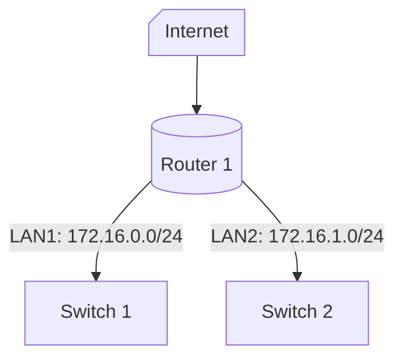

# IPv4

 

O IPv4 é um endereço de rede lógico que identifica um host em uma rede. Ele deve ser configurado corretamente e de forma exclusiva dentro da LAN para que os dispositivos possam se comunicar entre si e com a Internet.

 

## Formato do endereço IPv4

O endereço IPv4 é composto por 32 bits, divididos em 4 octetos de 8 bits cada. Cada octeto é representado por um número decimal de 0 a 255, separados por pontos.

 

## Redes e hosts

O endereço IPv4 é dividido em duas partes: a parte da rede e a parte do host. A parte da rede identifica a rede em que o host está localizado, enquanto a parte do host identifica o host dentro da rede.

Por exemplo, o endereço IPv4 `192.168.5.11` é dividido em duas partes: os três primeiros octetos (`192.168.5`) indicam a porção da rede e o útimo octeto (`11`) indica a porção do host.

 

## Segmentação de rede

### Unicast

O endereço IPv4 unicast é um endereço de host único. Ele é usado para enviar pacotes de dados de um host para outro.

 

### Broadcast

O endereço IPv4 broadcast é um endereço especial que envia pacotes de dados para todos os hosts em uma rede. O broadcast pode ser **limitado** ou **direcionado**. O **broadcast limitado** é enviado para todos os hosts em uma rede local, enquanto o **broadcast direcionado** é enviado para todos os hosts em uma rede específica.

 

### Multicast

O endereço IPv4 multicast é um endereço especial que envia pacotes de dados para um grupo de hosts em uma rede. Ele é usado para enviar pacotes de dados para vários hosts ao mesmo tempo.

 

## Endereços IPs públicos e privados

Os endereços IPv4 são divididos em endereços públicos e privados. Os endereços públicos são usados para identificar hosts na Internet, enquanto os endereços privados são usados para identificar hosts em redes locais.
Endereços privados são definifods pelo IETF (Internet Engineering Task Force) na RFC 1918.

 

| Endereços de rede e prefixo | (RFC 1918) Faixa de endereços privados |
| --- | --- |
| 10.0.0.0/8 | 10.0.0.0 - 10.255.255.255 |
| 172.16.0.0/12 | 172.16.0.0 - 172.31.255.255 |
| 192.168.0.0 /16 | 192.168.0.0 - 192.168.255.255 |

 

## Roteamento para a Internet

A maioria dos dispositivos na Internet usa endereços IPv4 públicos para se comunicar uns com os outros. Para que os dispositivos em uma rede local se comuniquem com a Internet, eles precisam de um roteador que possa traduzir os endereços IPv4 privados em endereços IPv4 públicos

 

### NAT (Network Address Translation)

Antes que o ISP possa encaminhar um pacote de dados para a Internet, ele precisa traduzir o endereço IPv4 privado em um endereço IPv4 público. Isso é feito usando o NAT (Network Address Translation).

 

## Endereços IPv4 de uso especial

Existem vários endereços IPv4 de uso especial que são reservados para fins específicos. Alguns exemplos incluem:

- **Endereços de loopback**: (`127.0.0.0/8`) são comumente idennificados como `localhost` ou, somente, `127.0.0.1`. Eles são usados por um host para direcionar o tráfego de volta para si mesmo.
- **Endereços de link local**: (`169.254.0.0/16`) são mais conhecidos como endereços APIPA (Automatic Private IP Addressing) ou endereços auto-atribuídos. Eles são usados por um cliente Windows para se autoconfigurar caso o cliente não consiga obter um endereço IP por outros métodos. Podem ser usados em uma conexão ponto a ponto, mas não são comumente usados para este fim
- **Endereços de multicast**: (`224.0.0.0/4`) são usados para enviar pacotes de dados para um grupo de hosts em uma rede.
- **Endereços de broadcast**: O broadcast direcionado é enviado para todos os hosts em uma rede específica e ele utiliza o último endereço IP daquela rede. O broadcast limitado é utiliza o endereço `255.255.255.255` para enviar pacotes de dados para todos os hosts em uma rede local.

 

## Endereçamento Classful Legacy

Em 1981, o IETF (Internet Engineering Task Force) introduziu o endereçamento classful legacy, que divide os endereços IPv4 em cinco classes: A, B, C, D e E. Cada classe tem um intervalo de endereços específico e um prefixo de rede.

- **Classe A**: (`0.0.0.0/8 a 127.0.0.0/8`) é usada para redes grandes, com muitos hosts. O primeiro octeto é o número da rede e os três octetos restantes são o número do host. Mais de 16 milhões de endereços de host.
- **Classe B**: (`128.0.0.0/16 a 191.255.0.0/16`) é usada para redes médias, com um número moderado de hosts. Os dois primeiros octetos são o número da rede e os dois octetos restantes são o número do host. Mais de 65 mil endereços de host.
- **Classe C**: (`192.0.0.0/24 a 223.255.255.0/24`) é usada para redes pequenas, com um número limitado de hosts. Os três primeiros octetos são o número da rede e o último octeto é o número do host. Mais de 254 endereços de host.
- **Classe D**: (`224.0.0.0/4`) é usada para endereços multicast.
- **Classe E**: (`240.0.0.0 a 255.0.0.0`) é um bloco de endereço experimental.

Em meados da década de 1990, o IETF introduziu o endereçamento classless, que permite que os endereços IPv4 sejam divididos em sub-redes menores, independentemente da classe original.

 

## Atribuição de endereços IPv4

Os endereços IPv4 públicos são endereços roteados globalmente pela Internet. Endereços IPv4 públicos devem ser exclusivos e não podem ser duplicados em diferentes redes.
Os endereços IPv4 e IPv6 são gerenciados pela IANA (Internet Assigned Numbers Authority), que atribui blocos de endereços para os RIRs (Regional Internet Registries), que por sua vez atribuem blocos de endereços para ISPs (Internet Service Providers) e organizações.

 

### Registros Regionais da Internet (RIRs)

Os RIRs são organizações que gerenciam a alocação de endereços IP em uma região geográfica específica. Existem cinco RIRs em todo o mundo:

- **ARIN (American Registry for Internet Numbers)**: América do Norte  
- **RIPE NCC (Réseaux IP Européens Network Coordination Centre)**: Europa, Oriente Médio e Ásia Central
- **APNIC (Asia-Pacific Network Information Centre)**: Ásia e Pacífico
- **LACNIC (Latin America and Caribbean Network Information Centre)**: América Latina e Caribe
- **AfriNIC (African Network Information Centre)**: África

 

## Segmenteção de rede

### Domínio de broadcast e segmentação de rede

Em uma LAN Ethernet, os dispositivos usam o broadcast e o ARP (Address Resolution Protocol) para localizar outros dispositivos na rede. O ARP envia broadcasts da Camada 2 para um endereço IPv4 conhecido na rede local para descobrir o endereço MAC correspondente. Os dispositivos em LANs Ethernet localizam outros dispositivos na rede usando o ARP e o broadcast. Um host normalmente adquire sua configuração de rede por meio do DHCP (Dynamic Host Configuration Protocol) que envia um broadcast para localizar um servidor DHCP.

Os switches propagam broadcasts para todas as portas, exceto a porta de origem. Por exemplo, quando um switch recebe um broadcast, ele o encaminha para os outros switches e hosts na rede. 

 

### Roteadores segmentam domínios de broadcast

Os roteadores segmentam domínios de broadcast, o que significa que eles não propagam broadcasts de uma rede para outra. 

 

### Problemas com domínios de broadcast grandes

Domínios de broadcast grandes podem causar problemas de desempenho na rede, como tráfego de broadcast excessivo, colisões de pacotes e tempos de resposta lentos. 
A solução para esses problemas é segmentar a rede em sub-redes menores usando roteadores e switches. Os espaços de redes menores são chamados de sub-redes.

 

Na figura abaixo, os 400 usuários da rede LAN 1 com o endereço de rede `172.16.0.0/16` foram divididos em duas sub-redes de 200 usuários cada: `172.16.0.0/24` e `172.16.1.0/24`. Cada sub-rede tem seu próprio switch e são separadas por um roteador. O roteador segmenta o domínio de broadcast, o que significa que ele não propaga broadcasts de uma rede para outra.

 

 

Observe como o comprimento do prefixo mudou de `/16` para `/24` para cada sub-rede. 

 

## Razões para segmentar redes

A divisão em sub-redes reduz o tráfego total da rede e melhora o seu desempenho. Isso é especialmente importante em redes grandes com muitos hosts. A segmentação de rede também melhora a segurança, pois limita o tráfego de broadcast e impede que os hosts em uma sub-rede acessem hosts em outras sub-redes.

Há várias maneiras de segmentar uma rede:

- **Localização**: Segmentar a rede com base na localização física dos dispositivos. Por exemplo, uma empresa pode ter uma sub-rede para cada andar de um prédio.
- **Departamento**: Segmentar a rede com base no departamento ou função dos dispositivos. Por exemplo, uma empresa pode ter uma sub-rede para o departamento de vendas e outra para o departamento de marketing.
- **Tipos de dispositivos**: Segmentar a rede com base no tipo de dispositivo. Por exemplo, uma empresa pode ter uma sub-rede para dispositivos de armazenamento, outra para dispositivos de computação e outra para impressoras.

 

