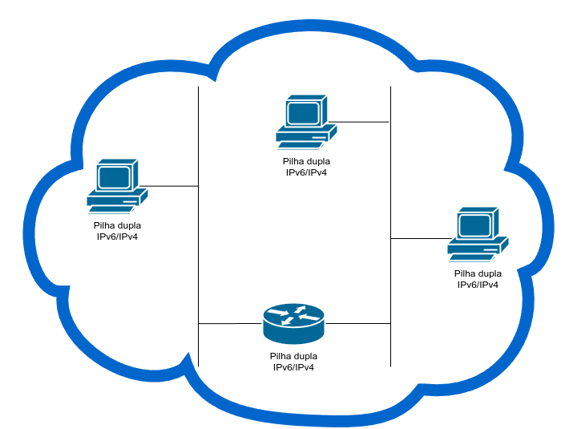
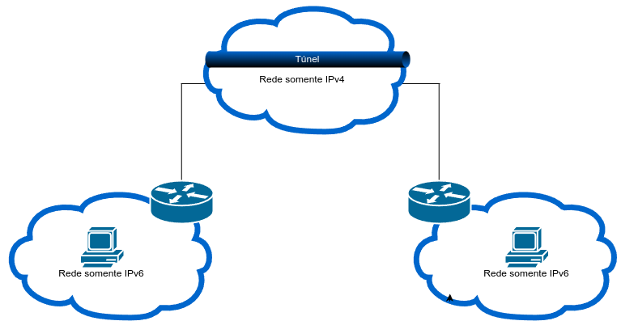
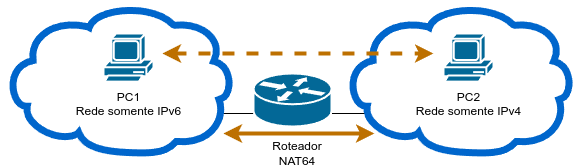
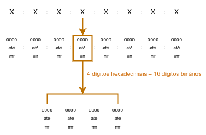

# IPv6

Como o IPv4 está ficando sem endereços o IPv6 foi projetado para ser o seu sucessor.
O IPv6 tem um espaço de endereço maior, de 128 bits, fornecendo 340 undecilhão (ou seja, 340 seguidos de 36 zeros) de endereços possíveis.

O IPv6 foi desenvolvido pela IETF que além de corrigir as limitações do IPv4 adicionou aprimoramentos ao IPv6. Por exemplo, o ICMPv6 (Internet Control Message Protocol versão 6), que inclui a resolução de endereços e a configuração automática de endereços, não encontradas no ICMP para IPv4 (ICMPv4).

<br>

## Coexistência entre IPv4 e IPv6

O IPv4 e o IPv6 coexistirão no futuro e a transição levará anos. As técnicas de migração podem ser divididas em 03 categorias:

- **Pilha dupla**: Permite que o IPv4 e IPv6 coexistam no mesmo segmento de rede. Os dispositivos de pilha dupla executam os protocolos IPv4 e IPv6 simultaneamente. Conhecido como IP nativo, isso significa que a rede tem uma conexão IPv6 com seu ISP e é capaz de acessar o conteúdo encontrado na internet através de IPv6.




<br>

- **Tunelamento**: É um método de transporte de pacote IPv6 através de uma rede IPv4. O pacote IPv6 é encapsulado dentro de um pacote IPv4, de forma semelhante a outros tipos de dados.



<br>

- **Conversão**: O NAT64 (Network Address Translation 64) permite que os dispositivos habilitados para IPv6 se comuniquem com os dispositivos habilitados para IPv4 usando uma técnica de conversão semelhante ao NAT IPv4. Um pacote IPv6 é traduzido para um pacote IPv4 e um pacote IPv4 é traduzido para um pacote IPv6.



<br>

>[!NOTE]
>O tunelamento e a tradução são para a transição e só devem ser usados quando necessário. O objetivo deve ser as comunicações IPv6 nativas da origem até o destino.

<br>

## Formatos do endereçamento IPv6

Os endereços IPv6 têm 128 bits e são escritos como uma sequência de valores hexadecimais. Cada 4 bits são representados por um único dígito hexadecimal, totalizando 32 valores hexadecimais. Os endereços IPv6 não diferenciam maiúsculas de minúsculas.

<br>

### Segmentos de 16 bits ou Hextets



<br>

### Formato Preferencial

O formato preferencial para escrever o endereço IPv6 é `X:X:X:X:X:X:X:X`, com cada `X`consistindo em quatro algarismos hexadecimais. Cada `X` é um único hexteto de 16 bits ou quatro digitos hexadecimais.

O formato preferencial significa que o endereço IPv6 é gravado usando todos os 32 dígitos hexadecimais. 

<br>

Exemplos de endereços IPv6 no formato preferencial:

```
2001 : 0db8 : 0000 : 1111 : 0000 : 0000 : 0000: 0200
2001 : 0db8 : 0000 : 00a3 : abcd : 0000 : 0000: 1234
2001 : 0db8 : 000a : 0001 : c012 : 9aff : fe9a: 19ac
```

<br>

### Regras de formatação IPv6

Existem 02 regras que ajudam a reduzir o número de dígitos necessários para representar um endereço IPv6:

<br>

#### Regra 1: Omitir qualquer 0s (zeros) à esquerda em qualquer hexteto

<br>

Podemos omitir qualquer 0s (zeros) à esquerda em qualquer hexteto.
Usaremos o endereço IPv6 abaixo como exemplo

```
2001 : 0db8 : 0000 : 1111 : 0000 : 0000 : 7000: 0200
```

<br>

Após omitir os zeros à esquerda o endereço IPv6 ficará da seguinte forma

```
2001 : db8 : 0 : 1111 : 0 : 0 : 7000: 200
```

<br>

#### Regra 2: Os dois-pontos duplos (`::`)
  
<br>

Para ajudar a reduzir a notação de endereços IPv6 podemos utilizar dois pontos duplos (`::`) para substituir qualquer string única e contígua de um ou mais hextetos de 16 bits consistindo em zeros.  
Os dois-pontos duplos (`::`) só podem ser usados uma vez dentro de um endereço.   
A técnica dos dois-pontos duplos (`::`) pode ser associada a técnica de omissão dos zeros à esquerda. É o chamado **formato compactado**.

<br>

| Tipo | Formato |
| --- | --- |
| Preferencial | `2001 : 0db8 : 0000 : 1111 : 0000 : 0000 : 0000 : 0200` |
| Compactado / espaços | `2001 :  db8 :    0 : 1111 :                    :  200`|
| Compactado | `2001:db8:0:1111::200` |
| Preferencial | `2001 : 0db8 : 0000 : 0000 : ab00 : 0000 : 0000 : 0000` |
| Compactado / espaços | `2001 :  db8 :    0 :    0 : ab00 ::` |
| Compactado | `2001:db8:0:0:ab00::` |
| Preferencial | `2001 : 0db8 : aaaa : 0001 : 0000 : 0000 : 0000 : 0000` |
| Compactado / espaços | `2001 :  db8 : aaaa :    1 ::` |
| Compactado | `2001:db8:aaaa:1::` |
| Preferencial | `fe80 : 0000 : 0000 : 0000 : 0123 : 4567 : 89ab : cdef` |
| Compactado / espaços | `fe80 :                    :  123 : 4567 : 89ab : cdef` |
| Compactado | `fe80::123:4567:89ab:cdef` |
| Preferencial | `fe80 : 0000 : 0000 : 0000 : 0000 : 0000 : 0000 : 0001` |
| Compactado / espaços | `fe80 :                                         :    1` |
| Compactado | `fe80::1` |
| Preferencial | `0000 : 0000 : 0000 : 0000 : 0000 : 0000 : 0000 : 0001 ` |
| Compactado / espaços | `::                                                   1` |
| Compactado | `::1` |
| Preferencial | `0000 : 0000 : 0000 : 0000 : 0000 : 0000 : 0000 : 0000 ` |
| Compactado / espaços | `::` |
| Compactado | `::` |