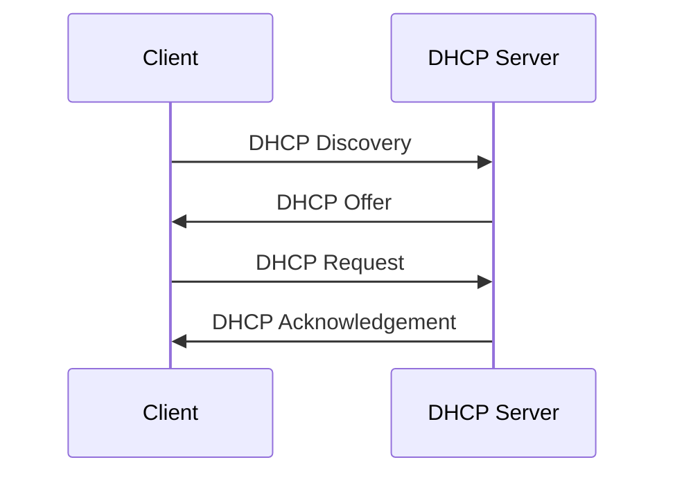

# DHCP

Os endereços IPv4 podem ser atribuídos estáticas ou dinamicamente. Com a atribuição estática, as informações de rede para um host devem ser configuradas manualmente.
Os endereços estáticos são úteis para impressoras, servidores e outros serviços de rede que precisam estar acessíveis para clientes na rede.

Os endereços dinâmicos são utilizados onde novas estações de trabalho precisam ser conectadas frequentemente. Os endereços dinâmicos são atribuídos automaticamente por um protocolo conhecido como **Dynamic Host Configuration Protocol** (DHCP).

O DHCP fornece um mecanismo para atribuição automática de informação de endereçamento, como endereço IPv4, máscara de sub-rede, gateway padrão e outras opções de configuração.

O endereço fornecido pelo DHCP não é permanentemente atribuído a um host, mas é só "alugado" por um período.

 

## Servidores DHCP

Vários tipos de dispositivos podem ser servidores DHCP, desde que executem software de serviço DHCP. Na maioria das redes médias a grandes, o servidor DHCP normalmente é um servidor local dedicado baseado em PC.

Muitas redes de residências e pequenas empresas usam um modem e um roteador sem fio. Nesse caso, o roteador sem fio é tanto servidor como cliente DHCP. O roteador sem fio atua como cliente para receber a configuração de IPv4 do ISP e atua como servidor DHCP para hosts internos na rede local. O roteador recebe o endereço IPv4 público do ISP e, em sua função como servidor DHCP, distribui endereços privados para os hosts internos.

Além de servidores baseados em PC e roteadores sem fio, outros tipos de dispositivos de rede (como roteadores dedicados) podem fornecer serviços DHCP aos clientes, embora isso não seja tão comum.

 

